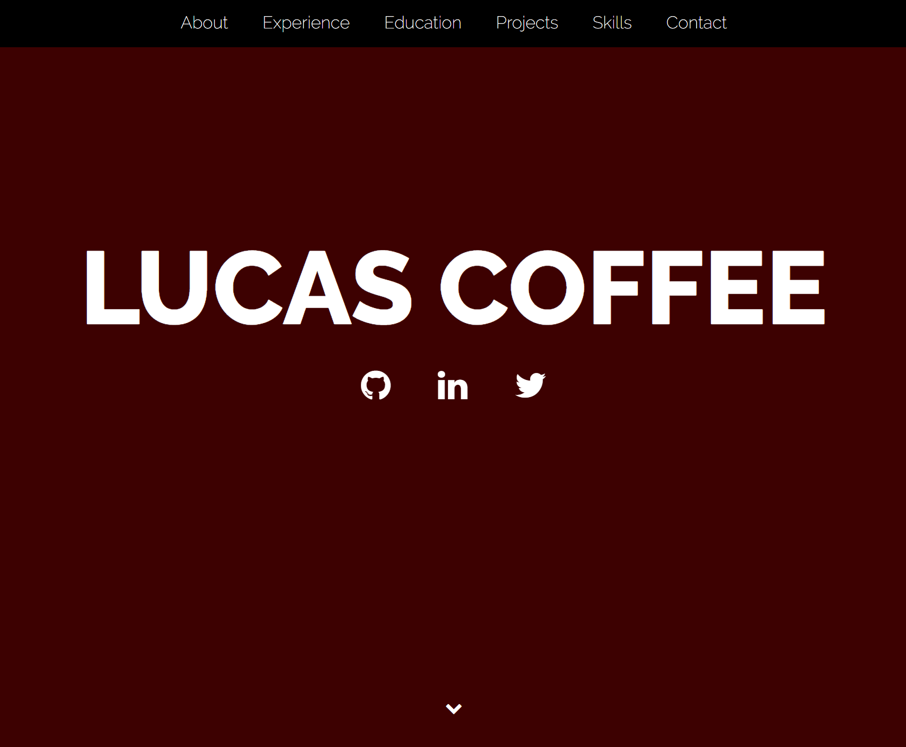

# Portfolio2 (technically 3) - Updated Portfolio Page

Welcome to my updated Portfolio Page

## Built With

* [HTML](https://developer.mozilla.org/en-US/docs/Web/HTML)
* [CSS](https://developer.mozilla.org/en-US/docs/Web/CSS)
* [Bootstrap](https://getbootstrap.com/)

## Deployed Link

* [See Live Site](https://kalashnikoffee.github.io/portfolio2/)

## Authors

* Lucas Cofee

- [Link to Portfolio Site](https://kalashnikoffee.github.io/responsive-bio/)
- [Link to Github](https://github.com/kalashnikoffee)
- [Link to LinkedIn](https://www.linkedin.com/in/lucas-coffee-08853719/)

## License

This project is licensed under the MIT License 

## Acknowledgments

Thanks again to Jerome, Kerwin, and Mahisha for their guidance.